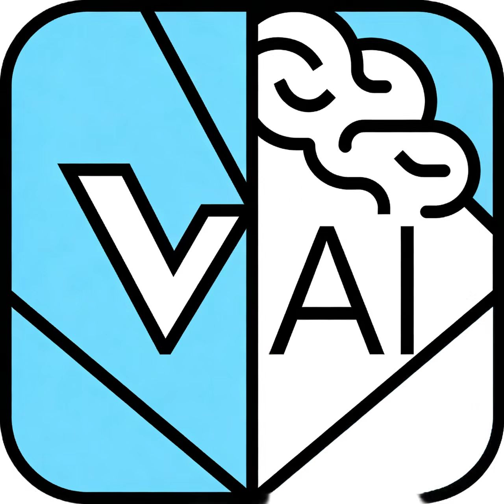

<div align="center">
  
  <h1>Vai-ui</h1>
  <p>专为 AI 对话场景打造的 Vue 3 组件库</p>

  <p>
    <a href="https://www.npmjs.com/package/@tom1612/vai-ui">
      
    </a>
    <a href="https://www.npmjs.com/package/@tom1612/vai-ui">
      
    </a>
    
    
    
  </p>

  <p>
    <a href="#快速开始">快速开始</a> ·
    <a href="https://github.com/Tom-kkk/Vai-ui">文档</a> ·
    <a href="https://github.com/Tom-kkk/Vai-ui/issues">问题反馈</a>
  </p>
</div>

---

## 简介

**Vai-ui** 是一套面向 AI 对话界面的 **Vue 3** 组件库，类似 React 生态的 [Ant Design X](https://x.ant.design)，专为快速搭建 AI Chat 应用而设计。

提供消息气泡、流式输出、思考过程、会话列表、文件附件等 **21 个开箱即用的组件**，让你专注业务逻辑，而非重复造轮子。

## 特性

- **AI 场景优先** — 消息气泡、流式打字、思考链路、引用来源，覆盖 AI 对话全流程
- **开箱即用** — 全局注册一行代码，无需单独引入
- **完全受控** — 所有状态由外部管理，轻松对接任意 AI 接口
- **主题定制** — 基于 CSS 变量的设计令牌体系，支持暗色模式
- **TypeScript 支持** — 附带类型声明文件

## 安装

```bash
npm install @tom1612/vai-ui
```

## 快速开始

### 全局注册

```js
import { createApp } from 'vue'
import VaiUi from '@tom1612/vai-ui'
import '@tom1612/vai-ui/dist/index.css'
import App from './App.vue'

createApp(App).use(VaiUi).mount('#app')
```

### 按需引入

```vue
<script setup>
import { VaiBubble, VaiSender } from '@tom1612/vai-ui'
</script>
```

### 基础示例

```vue
<template>
  <VaiProvider>
    <VaiBubbleList :messages="messages" />
    <VaiSender @send="handleSend" />
  </VaiProvider>
</template>

<script setup>
import { ref } from 'vue'

const messages = ref([
  { role: 'assistant', content: '你好！有什么可以帮你的？', status: 'success' }
])

function handleSend(text) {
  messages.value.push({ role: 'user', content: text, status: 'success' })
}
</script>
```

## 组件列表

### AI 专属组件

| 组件 | 说明 |
|------|------|
| `VaiAiChat` | AI 聊天对话框（消息历史 + 输入框一体化） |
| `VaiBubble` | 单条消息气泡，支持 Markdown、多状态、自定义头像 |
| `VaiBubbleList` | 消息列表容器，支持自动滚底 |
| `VaiSender` | 消息输入框，支持附件、快捷键 |
| `VaiTypingBubble` | 三点打字动画，流式输出等待态 |
| `VaiThinkProcess` | AI 思考步骤展示，可折叠步骤链 |
| `VaiSkeleton` | 骨架屏加载占位 |
| `VaiAttachments` | 文件附件选择器 |
| `VaiSuggestion` | 快捷建议 / 提示词列表 |
| `VaiFileCard` | 文件卡片，支持下载、进度、标签 |
| `VaiCodeHighlighter` | 代码语法高亮 |
| `VaiActions` | 消息操作栏（复制、点赞、点踩、重试） |
| `VaiConversations` | 侧边栏会话历史列表 |
| `VaiWelcome` | 欢迎引导页，展示品牌信息和快捷 Prompt |
| `VaiSources` | AI 回答引用来源列表 |
| `VaiProvider` | 全局配置提供者（语言、主题） |

### 基础 & 高级组件

| 组件 | 说明 |
|------|------|
| `VaiButton` | 多类型、多尺寸按钮，支持 loading 态 |
| `VaiTree` | 树形结构展示 |
| `VaiDatePicker` | 日历面板日期选择，v-model |
| `VaiPageHeader` | 页头（返回 + 标题 + 插槽） |
| `VaiVirtualList` | 固定行高虚拟滚动列表 |

## 项目结构

```
Vai-ui/
├── packages/
│   ├── components/          # 核心组件包 (@tom1612/vai-ui)
│   │   ├── <component>/     # 每个组件独立目录
│   │   ├── index.js         # 统一导出 + Vue Plugin
│   │   └── index.d.ts       # TypeScript 类型声明
│   └── theme/
│       └── index.css        # CSS 变量设计令牌
├── docs/                    # VitePress 文档站
│   ├── components/          # 组件 API 文档
│   └── demos/               # 交互 Demo
└── src/                     # 本地调试 App
```

## 本地开发

```bash
# 克隆仓库
git clone https://github.com/Tom-kkk/Vai-ui.git
cd Vai-ui

# 安装依赖
npm install

# 启动文档站（含交互 Demo）
npm run docs:dev

# 启动调试 App
npm run dev

# 构建组件库
npm run build
```

## 技术栈

- [Vue 3](https://vuejs.org/) — 核心框架
- [Vite](https://vitejs.dev/) — 构建工具
- [VitePress](https://vitepress.dev/) — 文档站
- [markdown-it](https://github.com/markdown-it/markdown-it) — Markdown 渲染
- [highlight.js](https://highlightjs.org/) — 代码高亮
- [DOMPurify](https://github.com/cure53/DOMPurify) — XSS 防护

## 贡献

欢迎提交 Issue 和 Pull Request！

1. Fork 本仓库
2. 创建你的特性分支：`git checkout -b feat/your-feature`
3. 提交改动：`git commit -m 'feat: add some feature'`
4. 推送分支：`git push origin feat/your-feature`
5. 发起 Pull Request

## License

[ISC](./LICENSE) © Tom-kkk
